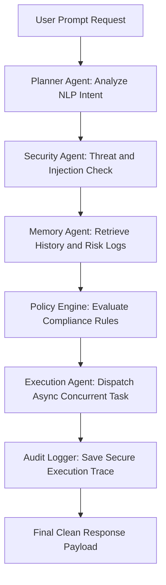

# Agent Orchestration Workflow Flowchart

Below is the workflow diagram mapping the GuardianAI platform:

```mermaid
graph TD
    UserRequest[User Prompt Request] --> PlannerAgent[Planner Agent: Analyze NLP Intent]
    PlannerAgent --> SecurityAgent[Security Agent: Threat and Injection Check]
    SecurityAgent --> MemoryAgent[Memory Agent: Retrieve History and Risk Logs]
    MemoryAgent --> PolicyEngine[Policy Engine: Evaluate Compliance Rules]
    PolicyEngine --> ExecutionAgent[Execution Agent: Dispatch Async Concurrent Task]
    ExecutionAgent --> AuditLogger[Audit Logger: Save Secure Execution Trace]
    AuditLogger --> Response[Final Clean Response Payload]
```
