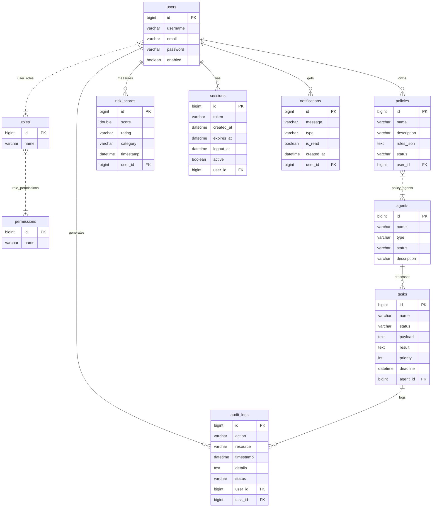

# GuardianAI - Database ER Diagram

This document describes the complete relational database schema for the GuardianAI AI-governance platform.

## Mermaid Entity Relationship Diagram

## Relationships Details

1.  **Identity Management (RBAC)**:
    *   `users` and `roles` form a Many-to-Many junction table (`user_roles`).
    *   `roles` and `permissions` form a Many-to-Many junction table (`role_permissions`).
2.  **Platform Governance**:
    *   Each `policy` is created by a `user` and is enforced across one or more `agents` (Many-to-Many junction `policy_agents`).
    *   `agents` manage and update `tasks` (One-to-Many).
3.  **Auditing & Sessions**:
    *   `sessions` and `notifications` map directly to `users` (One-to-Many).
    *   `risk_scores` log a timeline of compliance levels per user (One-to-Many).
    *   `audit_logs` record system actions, linking back to both the triggering `user` and the executing `task` context (Many-to-One).
